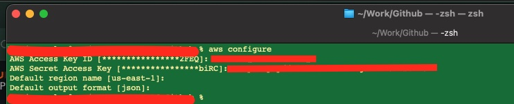

# Using AWS Sensor Operators  with Airflow in Cloudera Data Engineering 
## Overview
Some data engineering workloads need to be triggered when a specific file usually some delta load data "lands" on a specific location in a S3 bucket. The Airflow job then needs to sense the arrival of this file and trigger some dataprocessing steps. We use this simple demo to illustrate how to use AWS S3 Sensor operator in Airflow to achieve such a workflow

## Prerequisite
- Access to Cloudera Data Engineering Service Cluster
- Access Keys to AWS Tenant with S3 bucket that can be accessed from Cloudera Data Engineering service

## Instructions
- Let us use AWS Access keys the dataset to a S3 bucket
```
aws configure 
```
- The result should look like below

- Copy the CSV file included in this repo to a S3 bucket


- Next we need to configure our Airflow Connections. First  launch the Airflow web application for the cluster as shown below. 


- Click on the Admin menu item and connection menu item. 


- Add the connection details with the TOKEN details that were used earlier. 


- Now we will create 2 variables in airflow to pass the bucket name and key. This will allow us to change the location of the file without any change in airflow DAG. 


- Finally create and run a CDE Airflow Job using the attached DAG with either the CLI or UI and verify the output if the job executes properly. 


## Summary
In this tutorial we have learnt how to use the AWS S3 sensor to detect the availability of file in the Cloudera Data Engineering DAG. We have also templatized the code using Airflow variables that allows us to change locations or reapply the job to a different CDE cluster without any code change